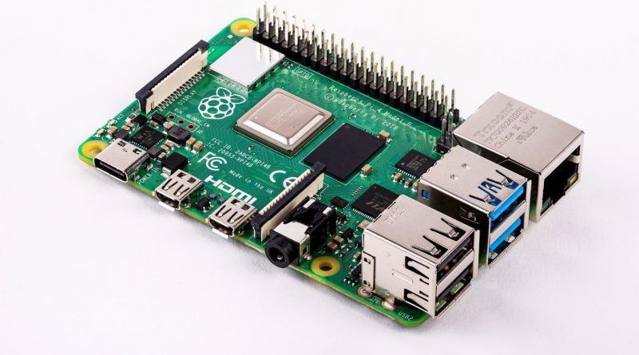

## Table of Contents

- [webOS](#webOS)
- [Raspberry Pi 4 介绍](#树莓派4模型B介绍)
- [在Raspberry Pi 4上安装webos 2.15.0](#在树莓派4模型B安装webos操作系统)
- [安装立方数字标牌播放APP](#how-to-install-app)

## webOS

Palm webOS是一个嵌入式操作系统，以Linux内核为主体并加上部份Palm公司开发的专有软件。它主要是为Palm 智能手机而开发。该平台于2009年1月8日的拉斯维加斯国际消费电子展宣布给公众，并于2009年6月6日发布。该平台是事实上的PalmOS继任者，webOS将在线社交网络和Web 2.0一体化作为重点。第一款搭载webOS系统的智能手机是Palm Pre，于2009年6月6日发售。由于Palm被HP收购，webOS被收归HP旗下。2011年8月19日凌晨，在惠普第三季度财报会议上，惠普宣布正式放弃围绕TouchPad平板电脑和webOS手机的所有运营,[更多介绍](https://baike.baidu.com/item/WebOS/3765958#:~:text=Palm%20webOS%E6%98%AF%E4%B8%80%E4%B8%AA%E5%B5%8C%E5%85%A5,6%E6%9C%886%E6%97%A5%E5%8F%91%E5%B8%83%E3%80%82)

参考资料
- [webOS开源社区](https://www.webosose.org/)
- [webos下载地址](http://build.webos-ports.org/webosose/)

## 树莓派4模型B介绍

Raspberry Pi 4 Model B是流行的Raspberry Pi系列计算机中的最新产品。 与上一代Raspberry Pi 3 Model B +相比，它在处理器速度，多媒体性能，内存和连接性方面取得了突破性的增长，同时保持了向后兼容性和类似的功耗。 对于最终用户，Raspberry Pi 4 Model B提供的台式机性能可与入门级x86 PC系统媲美

### 规格

#### 处理器：
Broadcom BCM2711，四核Cortex-A72（ARM v8）64位SoC @ 1.5GHz

#### 内存：
具有片上ECC的1G， 2G， 4G或8G LPDDR4

#### 连接
2.4GHZ和5.0 GHZ IEEE 8021b/g/n/ac 无线局域网，蓝牙5.0， BLE千兆以太网
2个USEB3.0
2个USB2.0

#### GPIO
标准的40引脚GPIO接头连接器

#### 视频和声音
2个微型HDMI端口（最多支持4Kp60)
2通道MIPI DSI 显示端口
2通道MIPI CSI 摄像端口
4针立体声音频和复合视频端口

#### 多媒体
H.265 (4Kp60解码)
H.264 (1080p 60解码, 1080p30解码)
OpenGL ES, 3.0 图形

#### SD卡支持：
Micro SD卡插槽，用于加载操作系统和数据存储

#### 输入功率：
通过USB-C连接器提供5V直流电（最小3A1）
通过GPIO接头提供5V DC（最低3A1）
启用了“以太网供电（PoE）”（需要单独的PoE HAT）

#### 环境：
工作温度0-50ºC

## 在树莓派4模型B安装webos操作系统