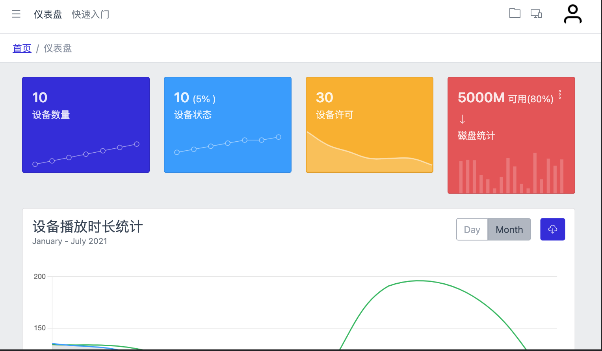

# 简介

RDS(Raspberry Digital Signage)Player是专门为Raspberry Pi 4设计的一款App，利用Raspberry Pi 4作为基板实现数字标牌的常见应用，RDS Player基于[WebOS OSE](https://www.webosose.org/)操作系统开发，实现图片，视频，时钟，天气，网页，pdf等播放功能.

## webOS 启动画面

## 安装数字标牌播放器画面

第一次系统启动需要首先激活设备

## 后台管理画面

